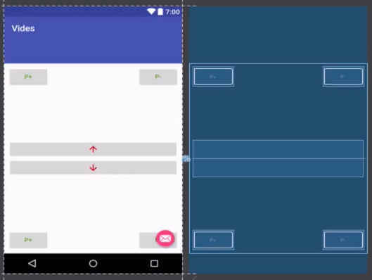

:stylesheet: assets/css/rocket-panda.css
:doctype: book
:page-layout!:
:toc: left
:toclevels: 2
:sectanchors:
:sectlinks:
:sectnums:
:icons: font
:experimental:
:stem:
:idprefix:
:idseparator: -
:ast: &ast;
:dagger: pass:normal[^&dagger;^]
:endash: &#8211;
:y: icon:check[role="green"]
:n: icon:times[role="red"]
:c: icon:file-text-o[role="blue"]
:table-caption!:
:example-caption!:
:figure-caption!:
:includedir: _includes
:underscore: _
:adp: AsciiDoc Python
:adr: Asciidoctor
:imagesdir: assets/images
:source-highlighter: prettify

= Apunts M08

== Introducció

L'objectiu d'aquestos apunts es guiar-vos en la creació d'una serie d'aplicacions de dificultat creixent.

Si seguiu el passos i completeu els exercicis adquirireu els conceptes i tècniques necessaris per a poder realitzar les vostres propies aplicacions per al SO Android.

== Contador de vides

Crear una aplicació que ens permeta portar el compte de vides i verins que tinga cada jugador en una partida de Magic.

S'han de mantindre els contadors si es gira la pantalla.

S'ha de poder resetejar els contadors en una opció de Menú.

=== Creació del projecte

* Creem un nou projecte
+
image:nou_projecte.png[]
+
No es necessari el suport per a C++.

* Triem el API level
+

* Creem una nova activitat de tipus *Basic Activity*
+

* Deixem el nom `MainActivity`. Seleccionem l'opció *Use a Fragment*
+
image:fragment.png[]

* Esperem mentre es crea el nou projecte

=== Disseny de l'aplicació

Hem de dissenyar un `layout` el més paregut possible a la següent imatge: 

Els passos son el següents:

* En acabar de crear-se el projecte sens presentarà la interfície de disseny
+

* Hem de verificar que es tracta d'un `ConstraintLayout`

* Agregarem una guia horitzontal que ens servirà per a separar les dues zones de l'aplicació
+
image::guia_horitzontal.png[]

** Farem click en la part esquerra del document fins que l'icona passe a ser un *%*.
+
image:esquerra.png[]  - image:percent.png[]

** Arrastrem la guia fins a deixar-la al 50%

* Utilitzant l'eina *New Vector Asset* creem imatges per al nostres botons.
+

** Necessitarem icones per passar vides d'un jugador a un altre (image:fletxa_amunt.png[] i ) i per a guanyar i perdre vides (image:cor_ple.png[] i image:cor_buit.png[]).

* Situem els `ImageButtons` (botons amb imatge) de les fletxes
** Els utilitzarem per passar vides d'un jugador a un altre
** Com volem que estiguen en la part central de la pantalla utilitzarem la guia central com a referència en l'eix vertical
** Per a que ocupen tota la pantalla fixarem els `constraints` esquerre i dret als laterals i fixarem com la opció `Layout Width` el valor `match_parent` (ocupar tot el valor del pare).
** Per últim, llevarem el marge entre els botons
** Utilitzant la propietat `tint` pintarem les icones de vermell.
** El resultat final ha de ser semblant al següent:
+
image:fletxes.png[]

* Situem els `Buttons` (botons de text)  per als verins
** Quedaran anclats als cantons (*dalt-esquerra*, *dalt-dreta*, *baix-dreta*, *baix-esquerra* - en el sentit de les agulles del rellotge).
** Deixarem el tamany dels botons per defecte
** El resultat ha de ser semblant al següent:
+

* Situem els `ImageButtons` per a les vides.
** Els utilitzarem per a sumar i restar vides de cada un dels jugadors.
** Els pintarem de color vermell.
** `Constraints`:
*** Cada botó anirà fixat al botó de verí més proper i a la guia central en el sentit vertical
*** En sentit horitzontal agafaran les referencies del botó de verí més proper.
** Els botons tindran el mateix tamany horitzontal que els botons de verí (opció `wrap_content` per a `Layout Width`).
** Per últim, llevarem el marge entre els botons
** Utilitzant la propietat `tint` pintarem les icones de vermell.
** Resultat:
+
image:botons_vida.png[]

* `TextViews` pels contadors
** Estaran centrats en la meitat superior i inferior del layout, respectivament
** Tamany (`TextSize`): 30sp
** Resultat:
+
image:textviews.png[]

* Fixar IDs
** Per a poder referenciar els botons i `TextViews` des de el codi hem de donar un ID a cadascun d'ells.

=== `findViewByIds`

El primer pas abans de poder assignar lògica als botons de la nostra interfície és el d'utilitzar findViewById per referenciar-los.

* Procés:
** Passem a la pantalla de codi principal.(`app/java/MainActivityFragment.java`).
** Accedim al objecte que fa referència al fragment (`view`) ja que aquest conté el métode findViewById. Guardarem una referència a aquest objecte
*** Substituirem el codi
+
[source,java]
----
return inflater.inflate(R.layout.fragment_main, container, false)
----
+
per
+
[source,java]
----
View view = inflater.inflate(R.layout.fragment_main, container, false);
return view;
----

** Fem totes les crides a findViewById
*** La sintaxi básica és
+
[source,java]
----
TipusComponent nom = view.findViewById(R.id.idComponent)
----
*** Resultat:
+
[source,java]
----
View view = inflater.inflate(R.layout.fragment_main, container, false);

ImageButton lifetwotoone = view.findViewById(R.id.lifetwotoone);
ImageButton lifeonetotwo = view.findViewById(R.id.lifeonetotwo);
Button p1poisonmore = view.findViewById(R.id.p1poisonmore);
Button p1poisonless = view.findViewById(R.id.p1poisonless);
Button p2poisonmore = view.findViewById(R.id.p2poisonmore);
Button p2poisonless = view.findViewById(R.id.p2poisonless);
ImageButton p1lifemore = view.findViewById(R.id.p1lifemore);
ImageButton p2lifemore = view.findViewById(R.id.p2lifemore);
ImageButton p2lifeless = view.findViewById(R.id.p2lifeless);
ImageButton p1lifeless = view.findViewById(R.id.p1lifeless);
TextView counter1 = view.findViewById(R.id.textView5);
TextView counter2 = view.findViewById(R.id.textView4);

return view;
----